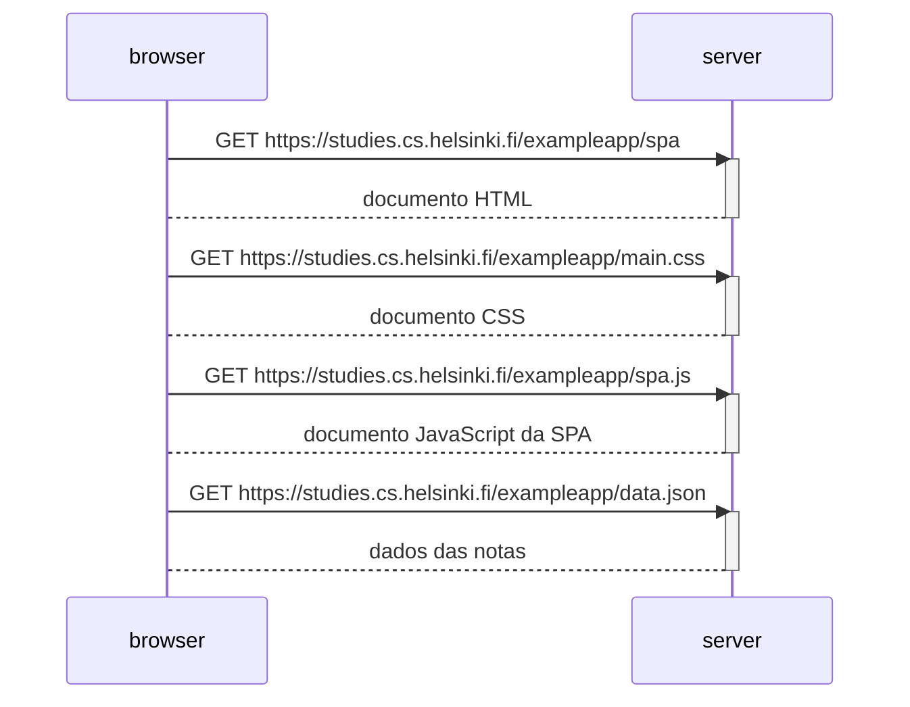

```mermaid
sequenceDiagram
    participant browser
    participant server

browser->>server: GET https://studies.cs.helsinki.fi/exampleapp/spa
activate server
server-->browser: documento HTML
deactivate server

browser->>server: GET https://studies.cs.helsinki.fi/exampleapp/main.css
activate server
server-->browser: documento CSS
deactivate server

browser->>server: GET https://studies.cs.helsinki.fi/exampleapp/spa.js
activate server
server-->browser: documento JavaScript da SPA
deactivate server

browser->>server: GET https://studies.cs.helsinki.fi/exampleapp/data.json
activate server
server-->browser: dados das notas
deactivate server

```